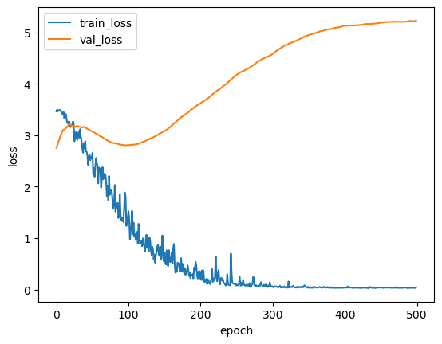
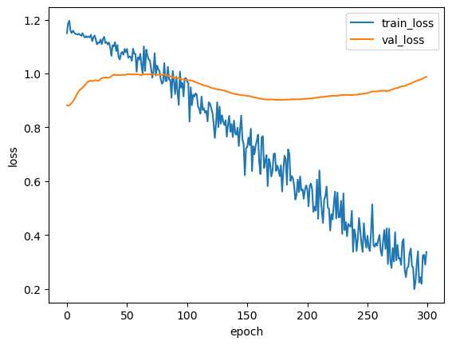
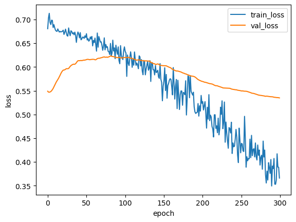
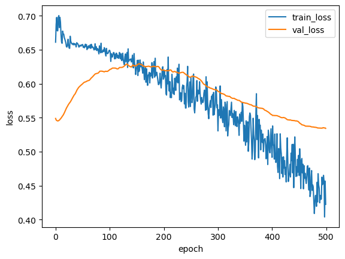
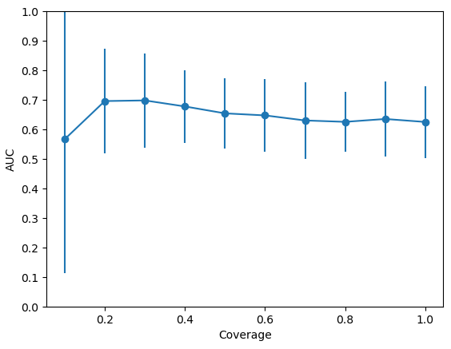
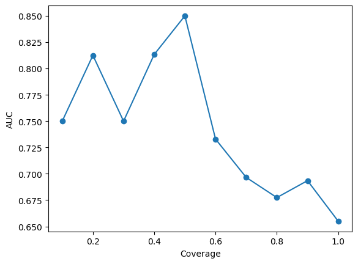
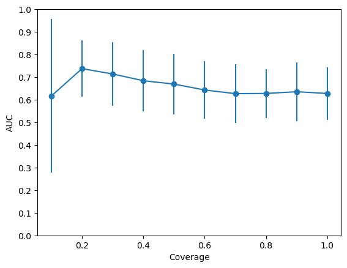
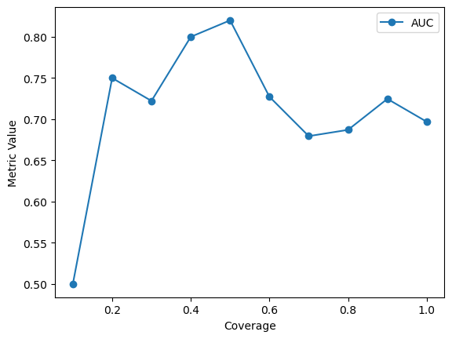
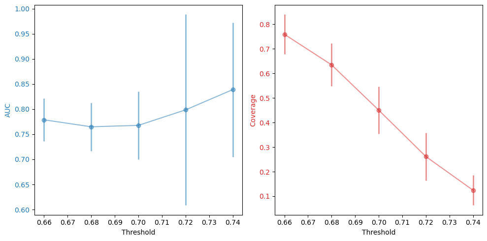

# SelectiveNet

::: {.incremental} 
- Train Selective models with batch size
:::

## Training
```{mermaid}
%%| label: fig-mermaid
%%| mermaid-format: png
%%| fig-width: 6
%%| fig-align: right
%%| fig-cap: Training with gradient accumulation
%%| fig-cap-location: margin

graph TD;
  Training[Training] --> SelectiveNet[SelectiveNet]
  Training --> GamblerNet[GamblerNet]
  SelectiveNet --> Sample1[Sample1]
  SelectiveNet --> Sample2[Sample2]
  SelectiveNet --> SampleX[SampleX]
  Sample1 --> X(( ))
  Sample2 --> X(( ))
  SampleX --> X(( ))
  X --> SelectiveLoss[SelectiveLoss]

  GamblerNet --> Sample_1[Sample1]
  GamblerNet --> Sample_2[Sample2]
  GamblerNet --> Sample_X[SampleX]
  Sample_1 --> Loss1[Loss1]
  Sample_2 -->Loss2[Loss2]
  Sample_X --> Loss3[LossX]

  Loss1 --> Loss(( ))
  Loss2 --> Loss(( ))
  Loss3 --> Loss(( ))
  Loss --> MeanLoss[Mean Gambler Loss]
```

## Selective Experiments
```{python}
#| label: tbl-planet-measures
#| tbl-cap: Astronomical object

from IPython.display import Markdown
from tabulate import tabulate
table = [["0.5","1"],
         ["0.5","3"],
         ["0.5","5"],
         ["0.5","10"]]
Markdown(tabulate(
  table, 
  headers=["Target_Coverage","Batch_Size"]
))
```

::: {style="font-size: 80%"}
Q:Do different training target coverage can have similar performance under a certain coverage?

Eg: When training with target coverage 0.5 and 0.7, do they have the same performance under 0.5?

:::


## SelectiveNet--Results

:::{layout="[[80,80],[80,80]]" #fig-Loss_Plot}

{width="50%" #fig-Loss}

{width="50%" #fig-Loss}

{width="50%" #fig-Loss}

{width="50%" #fig-Loss}

Loss plot of different batch size
:::

## SelectiveNet--Results


:::{layout=[[1,1],[1,1]] #fig-Coverage_Plot}

### By coverage

{width="50%"}

{width="50%"}

### By threshold

{width="70%"}

The model may not perform well under a certain coverage

fig-AUC by coverage and threshold (batch size 5)
:::

## SelectiveNet--Results


:::{layout=[[200,200],[50,50]] #fig-Coverage_Plot}
### By coverage

{width="50%"}

{width="50%"}

### By threshold


{width="70%"}


fig-AUC by coverage and threshold (batch size 10)
:::
