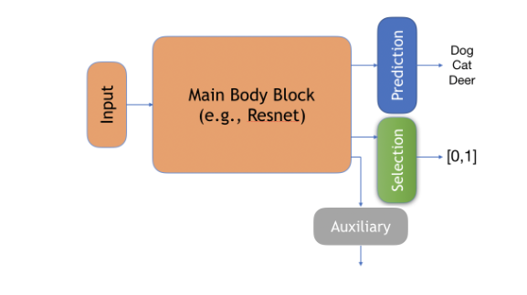

# Last Month

:::{.incremental}
- Try two selective methods
:::

# SelectiveNet
::: {layout="[[1,1]]" layout-valign="center" style="margin-bottom: 0px"}

{width=50% #fig-SelectiveNet}

[Target: Given a target coverage, minimize the loss]{style="font-size: 30px"}

:::

[Selective loss function:]{style="font-size: 15px"}

$$
\mathcal{L}_{(f,g)} \triangleq \hat{r}_e(f, g|\mathcal{S}_m) + \lambda \Psi(c - \phi(g|\mathcal{S}_m))
$$

[Emprical loss function:]{style="font-size: 15px"}
$$
\hat{r}(f, g|\mathcal{S}_m) \triangleq \frac{1}{m} \sum_{i=1}^{m} \frac{\ell(f(x_i), y_i)g(x_i)}{\phi(g|\mathcal{S}_m)}
$$

[Emprical coverage:]{style="font-size: 15px"}
$$
\hat{\phi}(g|\mathcal{S}_m) \triangleq \frac{1}{m} \sum_{i=1}^{m} g(x_i)
$$

[total loss function:]{style="font-size: 15px"}
$$
L = \alpha L(f,g) + (1 - \alpha)L_h
$$

## Training experiments

```{r}
#| label: table-exps-SENet
#| fig-cap: "Temperature and ozone level."
#| warning: false
#| echo: false
#| results: hide

print(3)
```

## Gradient-accmulation

## Analysis process
```{mermaid}
%%| label: fig-mermaid-1
%%| fig-width: 10
%%| fig-align: right
%%| fig-cap: Analysis process of SelectiveNet
%%| fig-cap-location: margin

flowchart LR;
    A["g(x_1), g(x_2), ..."] --> |"sorted by selection output"| B[sorted samples]
    B --> C1[Coverage:0.1]
    B --> C2[Coverage:0.2]
    B --> C3[Coverage:0.3]
    B --> C4[Coverage:...]
    C1 --> X(( ))
    C2 --> X(( ))
    C3 --> X(( ))
    C4 --> X(( ))
    A --> B_2[sorted samples]
    B_2 --> T1[Threshold: 0.6]
    B_2 --> T2[Threshold: 0.7]
    B_2 --> T3[Threshold: ...]
    T1 --> X(( ))
    T2 --> X(( ))
    T3 --> X(( ))
    X --> D[Evaluation]


```


# SelectiveNet

::: {.incremental} 
- Train Selective models with batch size
:::

## Training
```{mermaid}
%%| label: fig-mermaid-2
%%| mermaid-format: png
%%| fig-width: 6
%%| fig-align: right
%%| fig-cap: Training with gradient accumulation
%%| fig-cap-location: margin

graph TD;
  Training[Training] --> SelectiveNet[SelectiveNet]
  Training --> GamblerNet[GamblerNet]
  SelectiveNet --> Sample1[Sample1]
  SelectiveNet --> Sample2[Sample2]
  SelectiveNet --> SampleX[SampleX]
  Sample1 --> X(( ))
  Sample2 --> X(( ))
  SampleX --> X(( ))
  X --> SelectiveLoss[SelectiveLoss]

  GamblerNet --> Sample_1[Sample1]
  GamblerNet --> Sample_2[Sample2]
  GamblerNet --> Sample_X[SampleX]
  Sample_1 --> Loss1[Loss1]
  Sample_2 -->Loss2[Loss2]
  Sample_X --> Loss3[LossX]

  Loss1 --> Loss(( ))
  Loss2 --> Loss(( ))
  Loss3 --> Loss(( ))
  Loss --> MeanLoss[Mean Gambler Loss]
```


::: {style="font-size: 80%"}
Q:Do different training target coverage can have similar performance under a certain coverage?

Eg: When training with target coverage 0.5 and 0.7, do they have the same performance under 0.5?

:::


## SelectiveNet--Results

:::{layout="[[80,80],[80,80]]" #fig-Loss_Plot}

{width="50%" #fig-Loss}

{width="50%" #fig-Loss}

{width="50%" #fig-Loss}

{width="50%" #fig-Loss}

Loss plot of different batch size
:::

## SelectiveNet--Results


### By coverage
:::{layout=[[1,1],[1,1]] #fig-Coverage_Plot style="margin: 500px"}

{width="70%"}

{width="70%"}
:::


### By threshold

{width="70%"}

The model may not perform well under a certain coverage

fig-AUC by coverage and threshold (batch size 5)
:::

## SelectiveNet--Results


:::{layout=[[100,100],[50,50]] #fig-Coverage_Plot}
### By coverage

{width="10%"}

{width="10%"}

### By threshold


{width="70%"}


fig-AUC by coverage and threshold (batch size 10)
:::

## [New Section]

This is the first par{}

This is the seconde par

[mew]{style}

